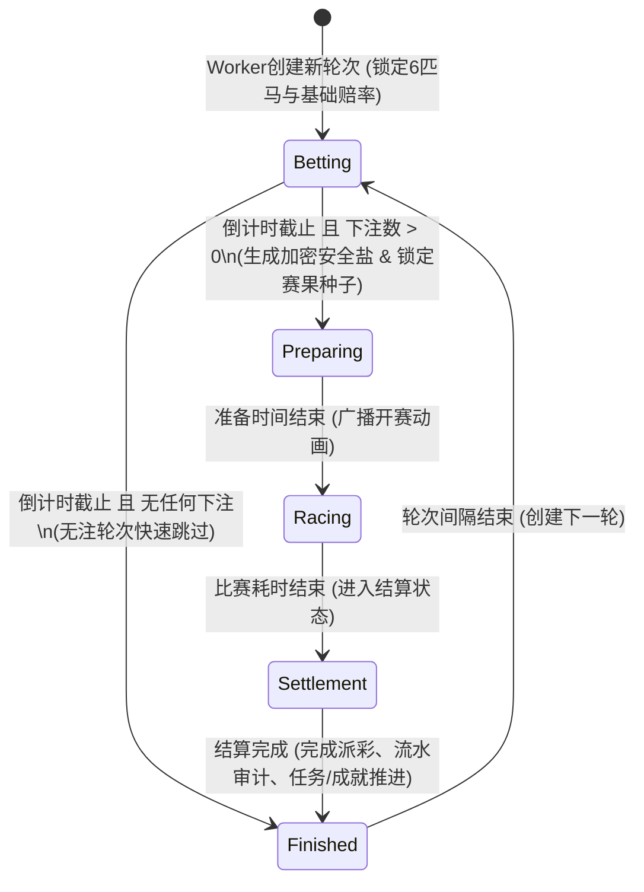
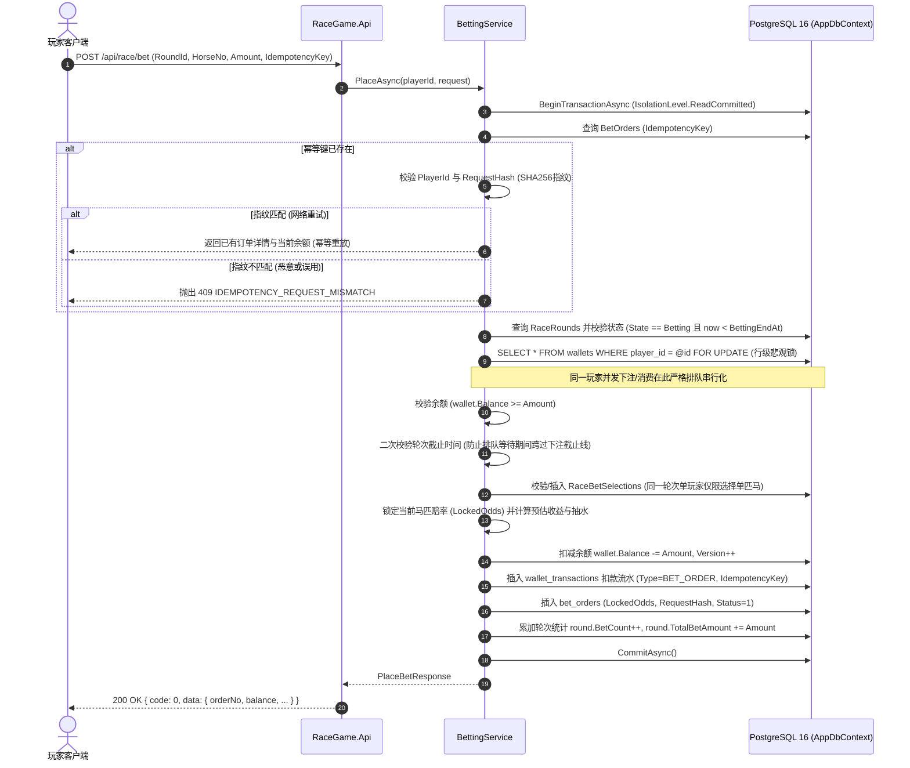
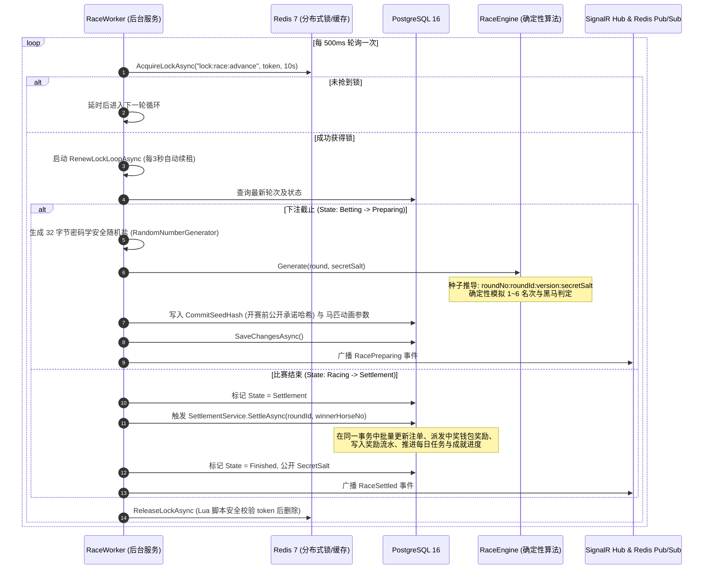
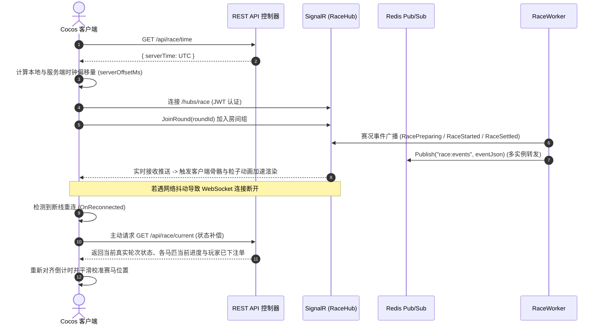

# RaceGame 技术架构 V2.0

## 1. 架构分层与依赖方向

```text
Cocos Creator 3.8.8 (Client)
        │ HTTPS (REST API) / WSS (SignalR)
        ▼
RaceGame.Api ───── SignalR Hub
        │
        ▼
RaceGame.Application (IGameDbContext 抽象)
        │
   ┌────┴──────────────────────────┐
   ▼                               ▼
RaceGame.Domain            RaceGame.Infrastructure
(纯业务实体与枚举)            (EF Core / PostgreSQL / Redis)
                                   │
RaceGame.Worker ───────────────────┤
(IHostedService 状态机推进)         │
                                   ▼
RaceGame.Admin ──────────── PostgreSQL 16 / Redis 7
```

- **目标依赖原则**：
  - `Domain` 是核心，严禁依赖 EF Core、ASP.NET Core、Redis 或客户端类型；
  - `Application` 编排业务用例，通过 `IGameDbContext` 等抽象接口访问持久化与基础设施；
  - `Infrastructure` 提供具体技术实现（EF Core、PostgreSQL、Redis 分布式锁与 Pub/Sub）；
  - `Api` 暴露 REST 控制器与 SignalR Hub，保持轻量薄层；
  - `Worker` 作为 BackgroundService 运行，时间驱动轮次状态流转与补偿；
  - `Admin` 独立提供运营与审计支撑能力。

---

## 2. 权威边界与零信任模型

- **Client（表现层）**：负责 UI 交互、720×1280 竖屏 HUD 布局、骨骼与粒子动画播放。**零权威**：绝不参与赛果计算、赔率决定、钱包扣款或奖励发放。
- **Server（权威源）**：所有状态流转、下注截止判定、赔率锁定、赛果推演与资金变动均由服务端权威计算并落库。
- **时钟基准**：全系统严格使用 **UTC 时间** (`TIMESTAMPTZ`)，严禁使用本地时间进行轮次判定；客户端通过 `/api/race/time` 对齐服务端时钟基准。

---

## 3. 比赛轮次生命周期（状态机模型）

轮次状态必须显式、单向、不可逆流转，数据库部分唯一索引保证同一时间仅存在**一个**活动轮次：



- **无注轮次优化**：当进入截止时间且 `BetCount == 0` 时，直接置为 `Finished` 跳过演出，节约服务端与客户端算力。
- **单向演进保证**：状态字段为持久化整数枚举，禁止随意逆向赋值。

---

## 4. 下注与钱包并发扣款事务设计

为防止并发透支、网络重试导致的重复扣款及撞 Key 攻击，系统采用**请求指纹 + PostgreSQL 行级排他锁 + 锁定赔率 + 事务内双写流水**架构：



---

## 5. Worker 分布式推进与确定性赛果生成

`RaceWorker` 采用 Redis 分布式锁避免集群多实例重复推进，并在关键状态切换时运用 Provably Fair 思想：



---

## 6. SignalR 实时广播、时钟同步与弱网补偿



---

## 7. 生产环境安全与配置规范

生产环境必须遵循“零代码硬编码，全外部注入”原则：

```bash
# 环境变量或容器 Secret 注入清单
ConnectionStrings__Default="Host=pg;Port=5432;Database=racegame;Username=...;Password=..."
Redis__Connection="redis:6379"
Redis__Password="<StrongRedisPassword>"
Jwt__Key="<AtLeast256BitsCryptographicKey>"
Jwt__Issuer="RaceGame"
Jwt__Audience="RaceGame"
Cors__AllowedOrigins__0="https://game.yourdomain.com"
```

- **安全审计红线**：
  1. 仓库内 `appsettings.Production.json` 绝不存放明文密码与有效密钥；
  2. 禁用 `AllowAnyOrigin` CORS 规则，严格限定正式域名与 Credentials；
  3. `dev-login` 与 Swagger 仅限本地/测试环境（Development / Staging）可用，禁止暴露到公网生产环境；
  4. 登录密码必须通过高强度 PBKDF2/Argon2 等哈希算法校验，连续失败 5 次自动锁定 10 分钟。
