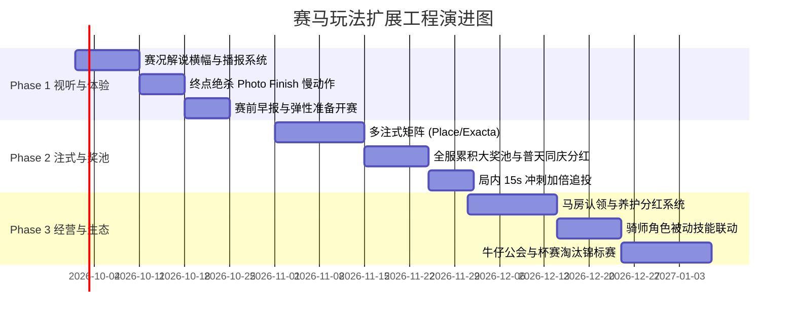

# 《西部边境赛马会》玩法拓展与系统改造需求设计规范 (PRD & Technical Design)

> 文档版本：V2.2-DRAFT  
> 更新时间：2026-09-16  
> 适用范围：RaceGame 核心玩法拓展、注式矩阵丰富、赛程视听表现升级、长线留存与经济循环改造  
> 技术基线：Cocos Creator 3.8.8 / .NET 10 / PostgreSQL 16 / Redis 7 / 纯虚拟币（COIN）体系  

---

## 目录
1. [背景与设计目标](#一-背景与设计目标)
2. [现有玩法痛点与改造方案](#二-现有玩法痛点与改造方案)
   - [2.1 下注期“垃圾时间”消除方案（Saloon 生态与弹性开赛）](#21-下注期垃圾时间消除方案saloon-生态与弹性开赛)
   - [2.2 比赛演出沉浸感与情绪巅峰化（Photo Finish 与动态解说）](#22-比赛演出沉浸感与情绪巅峰化photo-finish-与动态解说)
   - [2.3 角色与装扮数值赋能（骑师被动特性）](#23-角色与装扮数值赋能骑师被动特性)
3. [新增核心功能与拓展玩法设计](#三-新增核心功能与拓展玩法设计)
   - [3.1 阶梯式风险注式矩阵（Place / Quinella Place / Exacta / Trifecta）](#31-阶梯式风险注式矩阵place--quinella-place--exacta--trifecta)
   - [3.2 全服累积超级大奖池（Progressive Mega Jackpot）](#32-全服累积超级大奖池progressive-mega-jackpot)
   - [3.3 局内半程走地追加与冲刺加倍（In-Play Double Down）](#33-局内半程走地追加与冲刺加倍in-play-double-down)
   - [3.4 深度马主与马房养成系统（Stables & Breeding Tycoon）](#34-深度马主与马房养成系统stables--breeding-tycoon)
   - [3.5 社交与公会体系（Jockey Club & 杯赛锦标赛）](#35-社交与公会体系jockey-club--杯赛锦标赛)
4. [领域模型与数据库设计 (Database Schema & Enums)](#四-领域模型与数据库设计)
5. [网络协议与通信契约 (API & SignalR Events)](#五-网络协议与通信契约)
6. [落地实施里程碑规划 (Implementation Roadmap)](#六-落地实施里程碑规划)

---

## 一、 背景与设计目标

### 1.1 现状与市场对标
当前项目《西部边境赛马会》V2.0/V2.1 确立了稳定的 6 匹马、5 分钟一轮（180秒下注 / 15秒准备 / 30秒比赛 / 结算）、独赢（WIN）与 15 组街机连赢（QUINELLA）的双模式盘口，并具备服务端确定性种子（Provably Fair）、并发扣款幂等性与资金事务审计能力。

然而，对标成熟商业街机（世嘉《StarHorse》/《Royal Ascot》）、主机经典（《赛马大亨》/《达比骏马》）及专业虚拟体育平台，当前项目在**长线心流闭环、博弈策略丰富度、等待期趣味性与观赛情绪刺激**上存在明显短板。

### 1.2 核心改造设计目标
1. **消除无聊感（Zero Dead Air）**：将 180 秒下注期的玩家留存率提升，提供赛前决策辅助情报及酒馆休闲微游戏。
2. **构筑情绪巅峰（Emotional Climax）**：在 30 秒赛马中引入多机位微距绝杀、实时动态解说与天气氛围互动，激发多巴胺。
3. **完善风险收益曲线（Risk-Return Spectrum）**：由当前的“低赔（独赢）+ 中赔（连赢）”，扩展为从“保底型（位置 Place）”到“千倍梦想型（三重彩 Trifecta）”的完整阶梯。
4. **长线角色/马匹羁绊（RPG & Tycoon）**：由纯看客模式向“马主认领 + 骑师特性 + 公会合投”转化，构筑高黏性社交资产。

---

## 二、 现有玩法痛点与改造方案

### 2.1 下注期“垃圾时间”消除方案（Saloon 生态与弹性开赛）

#### 痛点说明
当前下注倒计时为 180 秒（3 分钟）。玩家通常在前 20~30 秒即完成下注，之后面临 **2 分半钟的空白等待期**，导致极高的切屏率与流失率。

#### 改造设计
1. **赛前晨报与专家推荐（Paddock Tipster）**：
   - 下注界面增加“老牛仔早报 / 赛马观察室”面板；
   - 结合本轮天气（晴朗、暴雨、大雾）、场地（硬草地、泥泞沙地），智能呈现各马匹的**适性评级（S/A/B/C）**、**晨练状态（绝好调/普通/低迷）**及**专家推荐星级**，为新手与休闲玩家提供即时下注线索。
2. **酒馆消遣轻微游戏（Saloon Minigames）**：
   - 玩家下注后，HUD 浮现“酒馆休息室”微入口：
     - **西部轮盘（Saloon Roulette）**：消耗 1~2 金币进行单轮幸运转盘，产出微量金币或比赛加油道具（如呐喊扩音器）；
     - **牛仔洗牌骰（Dice Duel）**：与酒馆老板比大小，填补 1~2 分钟空白。
   - 微游戏仅在 `RaceState.Betting` 开放，且在倒计时剩余 10 秒时自动收起并锁定。
3. **弹性准备与提前封盘（Ready & Skip）**：
   - 增加“准备就绪（Ready）”按钮；
   - 若当前房间内所有已下注活跃玩家均点击了“Ready”，且全服下注总额达到动态阈值，倒计时将**快速跳缩至最后 10 秒**准备封盘，极大提升游戏流转节奏。

---

### 2.2 比赛演出沉浸感与情绪巅峰化（Photo Finish 与动态解说）

#### 痛点说明
当前比赛动画为固定 30 秒水平匀速或简易插值位移，名次虽然由服务端决定，但过程缺乏赛马最扣人心弦的“冲线窒息感”与“现场激情”。

#### 改造设计
1. **终点鼻尖微差判定（Photo Finish 慢动作）**：
   - **触发判定**：服务端结算结果中，若第 1 名与第 2 名的完赛时间差 $\Delta t \le 0.18\text{s}$（约半个马身差距）；
   - **表现形式**：
     - 在最后 28.5 秒（距终点线前 10 米），游戏背景音乐瞬间静音，响起剧烈的心跳声（Heartbeat SFX）；
     - 画面进入**黑白复古胶卷滤镜 + 0.35x 极慢速特写镜头**；
     - 终点线投射出高精度激光标尺，两匹马并驾齐驱，以微距鼻尖贴线定格冲过终点；
     - 随后画面轰然恢复彩色，爆发出热烈的人群欢呼（Cheering）与礼花特效。
2. **动态赛况解说系统（Dynamic Race Commentary）**：
   - 跑道顶部常驻美式西部风格的黄色动态解说横幅（Commentary Marquee），配合不同阶段的快节奏播报语音/字幕：
     - **起跑段 (0~5s)**：*“闸门开启！4号迅猛出闸，抢占内道领先位置！”*
     - **中途段 (5~20s)**：*“进入弯道！2号紧咬不放，3号外侧受困正在加速摆脱！”*
     - **冲刺段 (20~27s)**：*“最后直道！全体起势！1号马力全开强行超车！胜负难料！”*
     - **绝杀段 (27~30s)**：*“终点线！双方并驾齐驱！谁才是最后的王者？！”*
3. **天气与赛道环境动态粒子联动**：
   - **暴雨天（Heavy Mud）**：跑道呈现积水反光图层，马蹄踩踏溅起深色泥浆飞沫粒子，屏幕边缘出现雨滴模糊特效；
   - **狂风沙（Sandstorm）**：大范围黄色飞沙横扫，跑道马蹄印凹痕消散速度加快，马匹领跑阻力视觉化呈现。

---

### 2.3 角色与装扮数值赋能（骑师被动特性）

#### 痛点说明
目前角色系统仅有外观与经验等级，缺乏与核心赛马博弈的深度联动，商城消费驱动力不足。

#### 改造设计
为每个角色注入**专属骑师执照特性（Jockey Passive Traits）**：

| 角色名称 | 角色定位 | 专属被动特性 (Passive Trait) | 数值平衡与约束 |
| :--- | :--- | :--- | :--- |
| **老牛仔·亚瑟** | 稳健型老手 | **【精打细算】**：获胜注单的平台抽水手续费从基础 12% 降为 10% | 仅对单场有效，限制每日前 10 局 |
| **赏金猎人·克林特** | 泥地专家 | **【风雨无阻】**：在雨天或泥泞赛道下注命中时，额外加赠 2% 奖金 | 基于结算层奖励加成，确保权威物理种子与可证明公平不受外部影响 |
| **红发女郎·贝拉** | 冒险投机家 | **【黑马狂欢】**：下注赔率 $\ge 20.0$ 的冷门组合并命中时，额外加赠 5% 奖金 | 由平台活动储备金垫付 |
| **警长·怀亚特** | 权威执法者 | **【逢凶化吉】**：单日遭遇连续 3 场全输时，自动返还第 3 场 15% 的下注本金 | 每日限触发 1 次 |

---

## 三、 新增核心功能与拓展玩法设计

### 3.1 阶梯式风险注式矩阵（Place / Quinella Place / Exacta / Trifecta）

在原有的 **独赢（WIN）** 和 **经典连赢（QUINELLA）** 基础上，引入国际与街机通用注式：

```
[极低风险]                                                           [极高风险]
  位置 (Place) ── 独赢 (Win) ── 扩连赢 (Q.Place) ── 连赢 (Quinella) ── 二连单 (Exacta) ── 三重彩 (Trifecta)
  (1.2~2.5倍)     (2~12倍)        (3~15倍)           (5~100倍)           (10~250倍)          (50~2000倍)
```

#### 1. 位置（Place / Show）—— 新手避险标配
- **规则**：选择 1 匹马，只要该马在比赛中取得**第 1 名或第 2 名**（若参赛马较多可扩展至前 3），即视为中奖。
- **数学模型与赔率**：
  设第 $i$ 号马夺冠概率为 $W_i$，第二名概率为 $R2_i$，则中奖概率 $P_{\text{place}}(i) \approx W_i + R2_i$。
  $$\text{Odds}_{\text{place}}(i) = \text{Clamp}\left(\frac{1 - \text{HouseEdge}}{P_{\text{place}}(i)}, 1.10, 3.50\right)$$
- **意义**：极高胜率，给新手与本金即将耗尽的玩家提供安全垫。

#### 2. 位置连赢 / 扩连赢（Quinella Place）
- **规则**：任选 2 匹马，只要这两匹马**双双进入本场前 3 名**（不计先后次序），即视为中奖。一局比赛共有 3 组组合中奖（1-2, 1-3, 2-3）。
- **数学模型**：中奖概率约为经典连赢的 3 倍，赔率约为连赢的 30%~40%。

#### 3. 二连单 / 准确单（Exacta）
- **规则**：任选 2 匹马，必须**严格按顺序**命中第 1 名与第 2 名（区分冠亚军，共 $A(6, 2) = 30$ 种可能）。
- **赔率**：
  $$P_{\text{exacta}}(i \to j) \approx W_i \times \frac{W_j}{1 - W_i}$$
  $$\text{Odds}_{\text{exacta}}(i \to j) = \text{Clamp}\left(\frac{1 - \text{HouseEdge}}{P_{\text{exacta}}(i \to j)}, 3.00, 500.00\right)$$

#### 4. 三重彩 / 三连碰（Trifecta / Trio）—— 梦想爆奖盘
- **规则**：任选 3 匹马，预测包揽前三名。
  - **Trio（三连碰）**：不分先后，共 $C(6, 3) = 20$ 种组合；
  - **Trifecta（三连单）**：精确命中 1st-2nd-3rd，共 $A(6, 3) = 120$ 种组合，单笔赔率可达 **1000 ~ 2000 倍**。

---

### 3.2 全服累积超级大奖池（Progressive Mega Jackpot）

#### 1. 资金池注入与累加公式
- 每一轮游戏中，系统将全服所有有效注单金额的 **1.5%** 作为彩池储备抽取，汇入公共 Redis 计数器 `jackpot:pool:coins`。
- 设定奖池保底种子（Seed Pool）：`100,000` 游戏币。

#### 2. 触发条件与爆奖裁决
满足以下任意一种情况时，当局触发 **“西部黄金大爆奖”**：
1. **天命黑天鹅**：本轮前两名由基础胜率最低的两匹冷门马夺得，且命中该 Exacta/Quinella 的注单赔率 $\ge 500.0$；
2. **幸运数字彩蛋**：开赛前通过 SHA-256 种子哈希值最后 4 位与本轮 RoundId 取模，若等于预设幸存数（概率为 $\frac{1}{1000}$），且该场比赛有有效注单。

#### 3. 派奖与全服分红机制
- **大奖得主分配**：命中触发条件的玩家按注单权重瓜分大奖池的 **70%**；
- **普天同庆分红（Rain Sharing）**：剩余 **30%** 由本轮所有参与下注的在线活跃玩家平分；
- **视觉全服震屏**：触发大奖时，全服客户端弹出全屏金色宝箱爆破动画，播放长达 10 秒的金币雨与全服横幅广播。

---

### 3.3 局内半程走地追加与冲刺加倍（In-Play Double Down）

#### 机制流程
1. **时间窗口**：当比赛进行到第 **15.0 秒**（弯道转入直道时刻），客户端暂停主交互，触发全屏 3 秒金色闪烁倒计时 **“冲刺加倍窗口 (15s ~ 18s)”**。
2. **加倍条件**：
   - 仅限对自己已下注且当前处于**前 3 名**的马匹发起；
   - 消耗与原注单相同的本金追加一次“强力马鞭（Whip Boost）”；
3. **收益判定**：
   - 追加成功后，该注单打上 `IsDoubleDown = true` 标签；
   - 结算时若该马最终夺得冠军，其净利润额外获得 **+50% 加成**；若未夺冠，则损失原注与追加款。
4. **技术安全约束**：服务端通过时间戳校验确保请求在 UTC 开赛后第 18 秒之前到达，超时直接 400 拒绝，防止网络作弊。

---

### 3.4 深度马主与马房养成系统（Stables & Breeding Tycoon）

> [!NOTE]
> **概念定位与基线关系澄清**：  
> 本节所定义的“马匹认领与股份分红”已作为**模式一衍生轻度玩法：名驹赞助俱乐部 (Horse Club & Sponsorship)**在当前代码库中完整落地（对应数据库迁移 `013_gameplay_expansion_and_parameters.sql`、数据表 `player_horse_stables` / `horse_dividends`、控制器 `StableController.cs` 与前端 `/api/stable/*` 接口）。  
> 包含个人独占赛马资产全生命周期成长（幼驹/青年/成年/职业）、五维属性与潜能封顶、装备装配、400m 资格审查、G1~G3 巡回赛、三代近亲遗传及公开拍卖行的**完整模式三（Frontier Thoroughbred Ranch）**，其全量统一规范以 [HORSE_RANCH_MODE_REQUIREMENTS.md](file:///d:/project/HorseRaceGame.git/Docs/02_Requirements/HORSE_RANCH_MODE_REQUIREMENTS.md) 与 [PRODUCT_BIBLE_V2.0.md](file:///d:/project/HorseRaceGame.git/Docs/00_Product/PRODUCT_BIBLE_V2.0.md) 为唯一权威基线。

#### 1. 马匹认领与股份认购（Horse Ownership）
- 玩家等级达到 5 级后，可前往【马房】消耗金币认领 1 匹专属赛马（或认购系统 6 匹名驹的马主股份）；
- 认领后玩家成为“注册马主”，可为马匹定制专属马衣、马鞍、马蹄铁及昵称头衔。

#### 2. 日常养护与状态调配（Conditioning）
- 每日可通过消耗少量金币或日常任务产出的道具进行养护：
  - **极品胡萝卜 / 精饲料**：恢复疲劳度，使马匹当天状态进入【绝好调】（胜率修正 +3%）；
  - **温泉理疗**：消除赛后负面损伤，维持巅峰状态。

#### 3. 头马分红与被动收益（Purse & Royalties）
- 当玩家认领的马匹在公共轮次中夺得前三名：
  - 系统向马主发放固定保底出赛荣誉分红（**第 1 名 200 🪙、第 2 名 100 🪙、第 3 名 50 🪙**）；
  - 即使玩家本人不在线，分红也会安全存入“马房金库”，登录后一键领奖。

#### 4. 退役配种与二代血统繁育（Breeding System）
- 参赛达到 100 场的老马可选择光荣退役进入种马场；
- 玩家可选择两匹退役马进行基因繁育，新生小马有几率继承父母的“冲刺爆发力”或“雨天抗滑性”稀有词条。

---

### 3.5 社交与公会体系（Jockey Club & 杯赛锦标赛）

#### 1. 达比牛仔公会（Jockey Club）
- 玩家可自建或加入公会；
- **公会联合合投（Syndicate Betting）**：公会会长或高胜率“精英骑师”可发起千倍三重彩合投方案，普通成员一键认购份额（Share），中奖后系统按比例自动结算派发。
- **公会马房技能**：公会全员升级科技树，解锁“全员手续费折扣”、“公会专属签到奖金”等。

#### 2. 边境达比金杯赛（Border Derby Championship）
- 每周六晚 20:00 开启周期性电竞赛事；
- 采用 16 强淘汰赛制（预选赛 → 8强赛 → 半决赛 → 巅峰决战）；
- 全服玩家在比赛前对各轮晋级结果发起阶段性竞猜，争夺独一无二的“全服达比金靴奖杯”与限定外观。

---

## 四、 领域模型与数据库设计

为支撑上述扩展玩法，在现有数据模型基础上进行扩展。

### 4.1 枚举扩展：玩法类型（`PlayType`）
持久化于 `bet_orders` 表的 `play_type` 字段：
```csharp
namespace RaceGame.Domain.Enums;

public enum PlayType
{
    Win = 1,              // 单马独赢 (6选1)
    Quinella = 2,         // 连赢二连碰 (15组)
    Place = 3,            // 位置/秀选 (跑入前2)
    QuinellaPlace = 4,    // 扩连赢 (双双进入前3)
    Exacta = 5,           // 二连单 (精准冠亚军，30组)
    Trio = 6,             // 三连碰 (前3名无序，20组)
    Trifecta = 7          // 三连单 (前3名精准排序，120组)
}
```

### 4.2 新增实体与表结构定义

#### 1. 全服累积大奖池记录（`jackpot_pools` & `jackpot_drop_logs`）
```sql
-- 全服累积大奖池
CREATE TABLE jackpot_pools (
    id BIGSERIAL PRIMARY KEY,
    pool_code VARCHAR(32) NOT NULL UNIQUE,       -- 如 'MEGA_COIN_POOL'
    current_amount NUMERIC(18, 2) NOT NULL DEFAULT 100000.00,
    seed_amount NUMERIC(18, 2) NOT NULL DEFAULT 100000.00,
    tax_rate NUMERIC(6, 4) NOT NULL DEFAULT 0.0150, -- 1.5% 注入率
    total_paid_out NUMERIC(18, 2) NOT NULL DEFAULT 0.00,
    last_dropped_at TIMESTAMPTZ,
    updated_at TIMESTAMPTZ NOT NULL DEFAULT NOW()
);

-- 大奖爆奖历史记录
CREATE TABLE jackpot_drop_logs (
    id BIGSERIAL PRIMARY KEY,
    round_id BIGINT NOT NULL REFERENCES race_rounds(id),
    pool_code VARCHAR(32) NOT NULL,
    total_drop_amount NUMERIC(18, 2) NOT NULL,
    winner_share_amount NUMERIC(18, 2) NOT NULL, -- 70% 胜者分得
    rain_share_amount NUMERIC(18, 2) NOT NULL,   -- 30% 全服在线均分
    trigger_reason VARCHAR(64) NOT NULL,
    created_at TIMESTAMPTZ NOT NULL DEFAULT NOW()
);
```

#### 2. 玩家专属马房与马主分红（`player_horse_stables` & `horse_dividends`）
```sql
-- 玩家专属马房认领表
CREATE TABLE player_horse_stables (
    id BIGSERIAL PRIMARY KEY,
    player_id BIGINT NOT NULL REFERENCES players(id),
    horse_catalog_id BIGINT NOT NULL REFERENCES horse_catalogs(id),
    custom_name VARCHAR(64),
    condition_level INT NOT NULL DEFAULT 100,    -- 状态值 0~100 (100为绝好调)
    care_count_today INT NOT NULL DEFAULT 0,
    total_career_races INT NOT NULL DEFAULT 0,
    total_career_wins INT NOT NULL DEFAULT 0,
    accumulated_purse NUMERIC(18, 2) NOT NULL DEFAULT 0.00, -- 累计待领分红
    adopted_at TIMESTAMPTZ NOT NULL DEFAULT NOW(),
    CONSTRAINT uk_player_horse UNIQUE (player_id, horse_catalog_id)
);

-- 马主分红发放明细
CREATE TABLE horse_dividends (
    id BIGSERIAL PRIMARY KEY,
    round_id BIGINT NOT NULL REFERENCES race_rounds(id),
    horse_catalog_id BIGINT NOT NULL REFERENCES horse_catalogs(id),
    player_id BIGINT NOT NULL REFERENCES players(id),
    dividend_amount NUMERIC(18, 2) NOT NULL,
    claimed BOOLEAN NOT NULL DEFAULT FALSE,
    created_at TIMESTAMPTZ NOT NULL DEFAULT NOW()
);
```

#### 3. 增强注单字段 (`bet_orders`)
在现有 `bet_orders` 表中追加扩展列：
```sql
ALTER TABLE bet_orders 
    ADD COLUMN IF NOT EXISTS third_horse_no INT DEFAULT NULL,
    ADD COLUMN IF NOT EXISTS is_double_down BOOLEAN NOT NULL DEFAULT FALSE,
    ADD COLUMN IF NOT EXISTS double_down_amount NUMERIC(18, 2) NOT NULL DEFAULT 0.00;
```

---

## 五、 网络协议与通信契约

### 5.1 REST API 契约扩充

#### 1. 提交复合注单 (`POST /api/race/bet`)
- **请求体（DTO）**：
```json
{
  "roundId": 1024,
  "playType": "Exacta", // Win, Quinella, Place, QuinellaPlace, Exacta, Trifecta
  "horseNo": 2,         // 第一顺位（冠军 / 单选号）
  "secondHorseNo": 4,   // 第二顺位（亚军 / 组合号）
  "thirdHorseNo": null, // 第三顺位（季军 / 三连彩组合号）
  "amount": 50.00,
  "idempotencyKey": "bet-exacta-uuid-1024-2-4"
}
```

#### 2. 局内半程冲刺加倍 (`POST /api/race/inplay/double-down`)
- **说明**：开赛后第 15~18 秒内触发冲刺追投。
- **请求体**：
```json
{
  "orderNo": "ORD20260916-0001",
  "idempotencyKey": "dd-ORD20260916-0001-uuid"
}
```
- **响应体**：
```json
{
  "code": 0,
  "message": "Double down accepted",
  "data": {
    "orderNo": "ORD20260916-0001",
    "additionalDeducted": 50.00,
    "newTotalBet": 100.00,
    "currentBalance": 1850.00
  }
}
```

#### 3. 获取全服奖池与赛前情报 (`GET /api/race/paddock-info`)
- **响应体**：
```json
{
  "code": 0,
  "data": {
    "jackpotPool": 128450.00,
    "weather": "Rainy",
    "trackType": "Muddy",
    "tipsterRecommendations": [
      { "horseNo": 3, "starRating": 5, "analysis": "擅长泥地作战，近3场雨战胜率达 66%" },
      { "horseNo": 1, "starRating": 4, "analysis": "领跑型悍将，出闸爆发力极强" }
    ]
  }
}
```

### 5.2 SignalR 实时下发事件契约

| 事件名称 | 触发时机 | 传输内容与作用 |
| :--- | :--- | :--- |
| `RaceCommentaryTick` | 比赛进行中每 3~5 秒 | `{ second: 15, text: "4号弯道强硬超车！", soundCue: "commentary_overtake" }` 驱动字幕与解说音效 |
| `PhotoFinishTriggered` | 完赛微距绝杀刻 | `{ horse1: 2, horse2: 5, gapTime: 0.04 }` 客户端收到后立即启动黑白胶卷慢动作定格 |
| `MegaJackpotDropped` | 结算时命中大奖 | `{ totalPool: 250000, winners: [...], rainBonusPerUser: 120 }` 触发全服金币雨与横幅广播 |
| `InPlayWindowOpened` | 开赛后第 15 秒 | `{ durationMs: 3000 }` 客户端弹出冲刺加倍按钮 |

---

## 六、 落地实施里程碑规划

根据工程影响范围与价值收益，建议分三个阶段稳健落地：



### 阶段一：视听沉浸与下注期减负（短期·低风险高回报）
- **核心目标**：彻底解决“下注等 3 分钟无聊”与“冲线平淡无刺激”的核心体验痛点。
- **交付内容**：
  1. 赛道实时解说字幕横幅与音效切片联动；
  2. 终点前两名微差 $\Delta t \le 0.18\text{s}$ 时的 Photo Finish 胶卷慢动作与心跳定格；
  3. 赛前专家早报与全员准备完毕弹性缩短倒计时机制。

### 阶段二：注式矩阵丰富与超级大奖池（中期·博弈与营收爆发）
- **核心目标**：补全新手保底与高玩高赔注式，引入全服彩金池制造破圈爆点。
- **交付内容**：
  1. 开放【位置 Place】（新手保本）与【二连单 Exacta】（进阶单挑）注式；
  2. 上线全服累积大奖池（Progressive Jackpot）与爆奖普天同庆分红；
  3. 局内 15 秒转弯处 3 秒限时“冲刺加倍”机制。

### 阶段三：马房经营与社交电竞（长期·长线留存与大世界闭环）
- **核心目标**：由“投币机看客”升维为“赛马大亨与马会俱乐部”。
- **交付内容**：
  1. 马房认领与日常调配、头马出赛荣誉分红；
  2. 牛仔骑师角色技能树与天气适性羁绊联动；
  3. 公会联合跟投与周末达比金杯淘汰赛。
