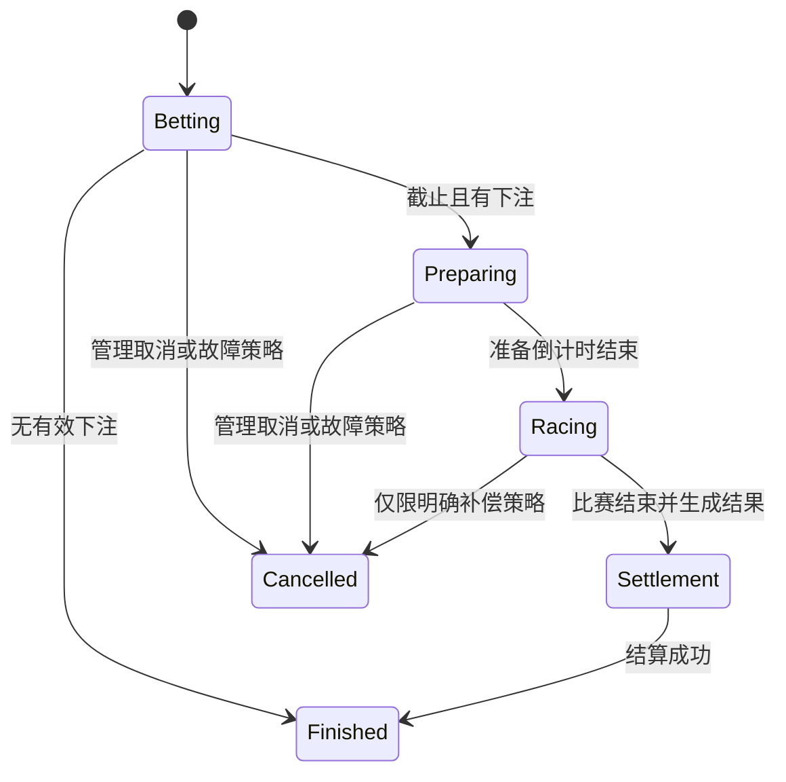

# RaceGame 产品需求文档

> 文档状态：Historical / Superseded by PRODUCT_REQUIREMENTS_V2.0.md  
> 编制日期：2026-09-07  
> 输入来源：用户提供的产品长图、阶段性产品答复、补充账号/马场/后台管理需求、当前 RaceGame V1.2 工程  
> 产品名称：赛马  
> 适用端：Cocos Creator 3.8.x 客户端、ASP.NET Core 10 服务端；计划支持 Android、iOS、HarmonyOS，并同步考虑发布 Steam

## 1. 文档说明

原始长图被压缩为窄幅预览，页面布局和功能分组可辨识，但大量小字号文案、精确数值以及末尾第三方平台品牌无法可靠读取。为避免把推测写成事实，本文使用以下来源标记：

| 标记 | 含义 |
| --- | --- |
| `[现有]` | 当前代码、数据库或仓库文档已经明确 |
| `[原型]` | 图片中可辨识的页面或交互 |
| `[整合]` | 结合原型与现有工程形成的目标需求 |
| `[待确认]` | 受图片清晰度或业务资料限制，开发前必须确认 |

若本文与后续高清原型、正式规则表或平台文档冲突，以经过评审并更新后的本文为准。

## 2. 产品概述

《赛马》是一款使用自有账号体系的赛马竞猜游戏。玩家注册并登录后进入大厅，查看从马场随机选出的 6 匹参赛马及其赔率，在下注阶段选择一匹马投入游戏币，观看比赛并获得结算结果。

产品包含个人胜率榜、马匹胜率榜、马场、角色/装扮、商城、每日任务和后台管理服务。所有资产均为游戏内虚拟资产，不提供提现且不涉及真实货币。首发设备方向为 Android、iOS 和 HarmonyOS，并要求与 Steam 版本保持账号数据互通和同步发售准备。

### 2.1 产品目标

1. 完成“登录 → 大厅 → 选马下注 → 倒计时 → 比赛 → 结算 → 结果”的闭环。
2. 服务端权威控制轮次、赛果、赔率、余额和结算，客户端只负责展示和输入。
3. 支持断线重连、重复请求和服务重启，不产生重复扣款或重复奖励。
4. 支持中英文、移动端竖屏体验，并为 Steam 桌面发布保留适配能力。
5. 提供全服累计榜单、马场资料、角色/物品、商城、任务和广告奖励等长期内容。

### 2.2 非目标

当前阶段不默认包含以下内容，除非另行确认：

- 真实货币下注、提现或任何形式的现金兑换。
- 玩家之间的游戏币转账、交易或场外交易。
- 客户端决定赛果或离线结算。
- 任何真实货币充值、下注或提现。
- 第三方平台账号登录；本期使用自有账号和密码。
- 密码找回、账号注销和邮箱验证流程。
- 广告奖励接入与现金购买商城；两者均保留后续能力但当前阶段不实施。
- 本期原型弹窗的精确文案和全部表现细节。

## 3. 当前工程基线

### 3.1 已具备

- `[现有]` 固定 6 匹马与 `RaceState` 轮次状态。
- `[现有]` 3 分钟下注、15 秒准备、约 30 秒比赛的 Worker 骨架。
- `[现有]` 当前轮次查询、轮次详情和下注接口骨架。
- `[现有]` 钱包、钱包流水、下注订单、轮次、参赛马等数据模型。
- `[现有]` PostgreSQL、Redis、SignalR 和 Docker Compose 基础依赖。
- `[现有]` Cocos 客户端轮次 DTO、倒计时和马匹位移动画示例。

### 3.2 尚未达到正式需求

- 自有账号注册、密码登录、令牌会话和修改密码。
- 钱包严格并发、完整幂等与可审计错误处理。
- Worker 多实例分布式锁、补偿任务恢复和任务审计。
- 稳定、可复核的服务端赛果算法、赔率算法和黑马权重算法。
- SignalR 状态广播、客户端重连和状态补偿。
- 完整比赛场景、下注交互、结果页、历史记录和双榜单。
- 马匹主数据、角色/装扮/物品、商城、每日任务、公告和后台管理服务。
- 自动化测试、生产安全配置与正式部署流程。

## 4. 用户角色

| 角色 | 说明 | 主要能力 |
| --- | --- | --- |
| 游客 | 尚未注册或登录的用户 | 注册账号、登录、查看用户协议和必要公告 |
| 玩家 | 已通过账号密码认证并建立游戏账户 | 进入大厅、下注、观看比赛、查看马场/余额/记录/榜单、使用商城/任务、管理角色展示 |
| 管理员/运营 | 配置游戏内容和查询数据的内部人员 | 后台设置角色、角色等级、经验、奖励、任务、任务奖励、任务条件、商城、马匹、马匹信息，查看用户账号、用户角色和用户比赛记录 |
| 系统任务 | 服务端 Worker | 创建轮次、推进状态、生成赛果、结算和广播 |

## 5. 核心业务规则

### 5.1 轮次

1. 每轮从后台维护的启用马匹池中随机选取 6 匹不同马匹，分配当轮 1–6 号赛道；可用马匹不足 6 匹时不得创建新轮次，并触发运营告警。
2. `[现有]` 默认流程为 `Betting → Preparing → Racing → Settlement → Finished`。
3. `[现有]` 默认下注时长 3 分钟，准备时长 15 秒，比赛时长约 30 秒；正式数值应配置化。
4. `[现有]` 无下注轮次可以直接结束；客户端应展示明确状态，不播放虚假奖励。
5. `[整合]` 状态推进由服务端完成，并通过 SignalR 广播；客户端重连后以 HTTP 当前状态校准。
6. `[整合]` 一轮只能生成一个最终结果，结果生成和结算必须可重试且不重复。

> `RaceState` 现有整数值已持久化，不得重排或复用。

### 5.2 下注与赔率

1. 仅登录玩家可下注。
2. 仅 `Betting` 状态且未超过服务端 UTC 截止时间时可下注。
3. 每位玩家每轮只能选择一匹马，但允许对同一匹马追加任意次数的下注；每次追加生成独立订单和幂等键。
4. 单笔下注最小金额为 2。产品层不设置单笔最大值、固定步进、快捷档位限制或单轮累计上限，但下注不得超过玩家可用余额和数据库金额类型的安全范围。
5. 每匹马维护总出场次数、总胜场次数以及第 1–6 名次数/概率。当前轮次的赔率，按“本轮上场 6 匹马的全部历史比赛记录”和“各名次概率值”进行同场相对计算后展示。
6. 赔率在轮次创建时计算并保存为当轮快照；玩家下单时再次锁定到订单，后续统计变化不得回写历史轮次或订单赔率。
7. 赔率算法必须版本化，且支持后台配置或切换参数；数据来源和设置类均由后台管理维护。
8. 每次提交携带客户端生成的幂等键；网络重试必须返回原订单，不得重复扣款。
9. 扣款、订单、玩家选马、轮次汇总和钱包流水必须在同一事务中保持一致。
10. 下注成功后返回订单号、锁定赔率、预计毛奖励、预计手续费、预计净奖励、最新余额和服务器时间。

### 5.3 赛果与结算

1. 服务端是赛果唯一权威来源，客户端动画不得改变名次。
2. 系统从马场启用马匹中随机抽取 6 匹参赛马，并根据每匹马历史出场次数、第 1–6 名概率和额外黑马权重执行加权随机，生成完整且不重复的 1–6 名排序。
3. 黑马权重按当前上场 6 匹马的总场次胜率降序排序后，取第 4–6 名作为黑马候选。以第 1/3/5 名胜率之和与第 2/4/6 名胜率之和的“当前概率差”作为触发依据；命中触发后，对第 4/5/6 名候选执行 1000 次随机抽样，命中次数最高者成为该轮黑马。整个流程必须版本化并保存快照。
4. 赛果至少包含马匹 ID、当轮马号、最终名次、完成时间、是否黑马、黑马触发信息和动画参数。
5. 赛果算法必须使用稳定版本号和可复核种子；不得继续以 `string.GetHashCode()` 作为跨进程确定性算法。
6. 获胜订单的毛奖励 `grossReward = betAmount × lockedOdds`。
7. 手续费率按毛奖励所在连续区间计算：`grossReward ≤ 10,000` 为 0.05%；`10,000 < grossReward ≤ 50,000` 为 0.1%；`50,000 < grossReward ≤ 100,000` 为 0.5%；`grossReward > 100,000` 为 1%。
8. 最终净奖励 `netReward = grossReward - grossReward × feeRate`；未获胜订单奖励和手续费均为 0。所有金额以“分”为最小单位，按四舍五入保留 2 位小数。
9. 每笔获奖订单最多生成一次奖励流水；手续费也必须作为可审计字段或独立流水保存。
10. 结算成功后，事务性更新马匹出场次数、各名次次数/概率以及玩家累计参赛/获胜统计。
11. 结算结果应可追溯到轮次、订单、算法版本、概率/赔率快照、黑马快照、手续费和钱包流水。

### 5.4 钱包与破产补偿

1. 余额仅为游戏内虚拟币，不与真实货币等价，不支持充值或提现。
2. 新账号首次创建时赠送 1,000 游戏币，并写入初始化流水。
3. 所有余额变化必须有不可缺失的钱包流水。
4. 钱包更新需使用数据库并发控制，防止并发下注导致负余额或覆盖更新。
5. 客户端只展示服务端返回余额，不在本地推导最终余额。
6. 当钱包余额恰好变为 0 时创建一条破产补偿倒计时，等待 2 小时后自动发放 1,000 游戏币。
7. 每个玩家每个伦敦自然日最多获得 5 次破产补偿；日界线按 IANA 时区 `Europe/London` 计算并自动适应夏令时。
8. 同一余额归零事件只能创建一个有效倒计时，同一补偿只能发放一次；服务重启不影响倒计时和发放。
9. 等待期间玩家即使通过任务或其他方式重新获得余额，已启动的 2 小时补偿倒计时仍继续，到期后照常发放。
10. 流水至少区分初始化赠送、下注扣款、比赛奖励、手续费、破产补偿、任务奖励、商城消费和运营调整。

## 6. 页面与交互需求

### 6.1 注册、登录与修改密码（P0）

- 本期不接入第三方账号登录，使用自有账号和密码体系。
- 账号和密码均支持数字、英文大小写和特殊字符，长度不少于 8 位；正式字符白名单和转义规则由服务端统一校验。
- 注册页包含自定义账号、密码和确认密码；两次密码不一致、账号已存在或不符合规则时禁止注册。
- 本期不提供邮箱验证、密码找回和账号注销。
- 注册成功后创建唯一玩家和初始 1,000 游戏币钱包，客户端返回登录页；用户必须重新输入账号和密码完成登录，不自动登录。
- 登录页使用账号和密码登录，成功后由服务端签发短期访问令牌和可撤销会话。
- 登录提示规则（已确认）：若玩家账号不存在，明确提示“账号不存在，请先注册账号”；若账号存在但密码错误，提示“账号或密码错误”；连续失败达到阈值后临时锁定。
- 设置页提供修改密码：必须输入旧密码、新密码和确认新密码；旧密码错误或两次新密码不一致时拒绝修改。
- 修改成功后撤销该玩家全部现有会话，客户端清除本地令牌并退出到登录页；玩家必须使用新密码重新登录。
- 密码只保存安全哈希，不得明文保存、记录或返回；账号枚举、暴力破解和凭据填充需通过统一错误提示、限流和审计缓解。
- 开发环境可保留 `dev-login`，但正式构建必须禁用。

### 6.2 游戏大厅/主场景（P0）

**来源：** `[原型]` 竖屏草地/赛场背景、中心角色、顶部状态区和底部导航。

- 顶部展示玩家摘要：昵称/头像或角色、等级、游戏币余额及网络状态。
- 中部展示当前角色或主视觉，并提供进入当前比赛的显著入口。
- 展示当前轮次号、状态和基于服务端时间校准的倒计时。
- 底部导航、从左到右依次为 任务 马场 赛事 排行 商城
- 首次进入、回到前台或重连后自动刷新玩家和当前轮次。

### 6.3 选马与下注面板（P0）

**来源：** `[原型][现有]` 图片中存在绿色六项选择区和数据表，现有工程固定 6 匹马。

- 同屏展示 1–6 号马卡片，至少包含马号、形象、名称/模板和当前赔率。
- 选中卡片有明确高亮，并同步显示已选马详情。
- 提供自由金额输入，最小值为 2，不强制固定步进或快捷档位；如 UI 保留快捷按钮，其数值只用于快速填充，不构成下注限制。
- 确认前展示下注金额、锁定赔率、预计毛奖励、手续费率/金额和预计净奖励。
- 点击确认后防重复提交；提交中禁用按钮。
- 成功后更新余额、已下注信息和订单状态；失败时区分截止、余额不足、重复、参数错误和网络失败。
- 截止后整个下注区域只读，自动进入准备状态。

### 6.4 准备与比赛场景（P0）

**来源：** `[原型][现有]` 原型含角色/赛场表现，现有场景文档定义 6 条赛道。

- 保持 `Canvas/RaceRoot/Track/Lane01..Lane06/Horse01..Horse06` 基础层级或同步更新绑定文档。
- 准备阶段显示倒计时和各马匹信息，禁止继续下注。
- 比赛阶段按服务端赛果参数驱动 6 匹马动画。
- 支持从后台返回或断线重连：根据服务器当前状态和时间恢复到合理进度。
- 性能不足时允许降低特效，但不得改变名次与完成顺序。
- 比赛结束后进入结果展示。

### 6.5 结果弹窗/结果页（P0）

**来源：** `[原型][现有]` 原型包含多种弹窗，当前场景文档已有 `ResultPanel`。

- 展示冠军、完整名次、玩家选择、输赢状态、奖励金额和结算后余额。
- 结算尚未完成时显示处理中状态，不提前本地发奖。
- 提供关闭、查看详情和进入下一轮的入口。
- 重复打开结果页不重复触发结算或奖励动画中的资产逻辑。

### 6.6 比赛记录与订单详情（P1）

**来源：** `[原型]` 图片包含多组列表/表格页面。

- 玩家可分页查看自己的下注记录。
- 列表显示轮次号、所选马、下注额、锁定赔率、订单状态、奖励和时间。
- 支持按状态或时间筛选
- 详情显示轮次最终排名和关联钱包流水摘要。
- 列表必须使用服务端分页，禁止一次拉取全部历史。

### 6.7 全服累计榜单（P1）

- 榜单从开服首个已结算轮次累计到当前，不按日、周、月等周期重置。
- **个人胜率榜：** 按玩家获胜轮次÷参与轮次计算；同一轮追加多笔下注只记一次参与/胜负，避免通过拆单改变胜率。
- **马匹胜率榜：** 按马匹第一名次数÷出场次数计算。
- 两个榜单均展示名次、对象名称、获胜次数、参与/出场次数和胜率；个人榜突出当前玩家。
- 排序默认先按胜率降序，再按有效样本数降序，最后按稳定 ID 升序；最低上榜样本数见第 12 节。
- 数据由服务端在结算后更新并通过缓存查询，客户端不得自行累计。

### 6.8 马场（P1）

- 将原型中的“成就壮举”入口和页面改为“马场”。
- 马场展示后台已上传且允许玩家查看的全部马匹，支持分页或虚拟列表。
- 马匹列表至少展示马匹名称/编号、形象、出场次数和胜率。
- 马匹详情至少展示基础资料、总出场次数、第一名次数、胜率以及第 1–6 名次数/概率。
- 马匹是跨轮次长期存在的主数据；`race_horses` 只保存某轮参赛马和当轮赔率/统计快照。
- 马匹新增、编辑、上下架和素材上传最终由后台管理完成；完整管理后台暂不在本期实现，开发期先提供受保护的导入/种子工具，禁止客户端直接上传。

### 6.9 角色、装扮与物品（P1）

- 玩家拥有一个当前展示角色；新账号直接获得默认角色，无需购买。
- 角色列表区分已拥有、未拥有和当前使用状态。
- 角色、装扮和物品仅影响视觉展示，不影响赔率、赛果、收益或榜单。
- 物品/装扮以网格展示，支持选中查看和装备/使用。
- 可通过比赛结算增加角色经验并发放角色成长奖励；具体经验表与奖励表仍需配置。

### 6.10 商城与每日任务（P1）

- 商城由后台管理配置，分为金币购买和现金购买两部分；当前阶段只实现金币购买，现金购买仅预留数据结构与后台配置能力，不开放客户端购买入口。
- 商品可包含纯展示角色、装扮或物品。购买必须校验余额、商品状态和购买限制，并在同一事务中完成扣款、流水和发货。
- 任务仅包含每日任务，由后台配置任务条件、奖励和启用状态。
- 当前确认的每日任务类型为：比赛场数（3、10、20）、比赛胜场（1、3、5）、比赛负场（1、3、5）。
- 任务奖励领取必须服务端校验达成状态和领取状态，并使用幂等键与审计记录。
- 广告奖励当前阶段不接入，不提供客户端入口，也不纳入本期验收范围。

### 6.11 设置、语言与时间（P1）

- 设置页支持简体中文和英文切换，并持久化到玩家偏好或本地配置。
- 语言切换后页面文案使用资源键刷新，不把业务文案硬编码在脚本中。
- 设置页提供第 6.1 节定义的修改密码入口。
- 服务端存储和内部比较统一使用 UTC；面向玩家的时间和每日次数边界按 `Europe/London` 展示与计算。

### 6.12 公告与规则（P1）

- 支持启动公告、活动公告和维护通知。
- 提供赛马规则、赔率/奖励/手续费说明及必要的虚拟资产提示。
- 公告支持强制阅读和按版本“不再提示”。
- 原型弹窗的精确文案和额外触发规则本期暂不展开。

### 6.13 后台管理服务（P1 基础能力，P2 完整化）

- 所有“数据获取类”和“设置类”能力均由后台管理服务维护和下发，游戏前台只读取经审核发布的数据。
- 后台管理服务至少支持：角色、角色等级、经验、奖励、任务、任务奖励、任务达成条件、商城、马匹、马匹信息、用户账号信息、用户角色信息、用户比赛记录。
- 马匹管理支持新增、编辑、上下架、素材上传、统计查看和批量导入；变更必须审计，且不得回写已结算轮次快照。
- 角色相关管理支持角色模板、等级经验表、升级奖励、默认发放策略和启用状态。
- 任务和商城管理支持配置启用状态、排序、奖励、条件、生效时间和展示信息。
- 用户管理支持查询账号、会话、余额、角色、比赛记录和补偿记录；敏感操作需要权限控制和审计。
- 运营调整余额必须双人授权或至少记录操作人、原因、前后余额和幂等键。
- 禁止直接在数据库手工修改余额作为常规运营方式。

## 7. 实时通信与状态恢复

### 7.1 HTTP 与 SignalR 分工

- HTTP：登录、玩家摘要、当前轮次快照、下注、记录、榜单和静态配置。
- SignalR：轮次状态变化、倒计时校准点、赛果可用、结算完成和必要的公告通知。
- 客户端不能假设事件不丢失；连接建立或恢复后必须重新拉取 HTTP 快照。

### 7.2 建议事件

| 事件 | 关键数据 | 客户端动作 |
| --- | --- | --- |
| `race.round.changed` | 轮次 ID、状态、服务器时间、阶段结束时间 | 校准状态与倒计时 |
| `race.result.ready` | 轮次 ID、算法版本、排名与动画数据 | 启动或恢复比赛表现 |
| `race.settlement.completed` | 轮次 ID、玩家订单结果、最新余额 | 展示正式结算结果 |
| `notice.published` | 公告 ID、版本 | 按策略刷新公告 |

事件名称为建议稿，正式开发前需冻结并形成客户端/服务端共享契约。

## 8. API 需求草案

保持现有 `/api/...` 前缀和 `{ code, data/message }` 响应信封。

| 方法与路径 | 用途 | 优先级 | 备注 |
| --- | --- | --- | --- |
| `POST /api/auth/register` | 注册账号、密码和确认密码 | P0 | 创建初始 1,000 钱包 |
| `POST /api/auth/login` | 账号密码登录 | P0 | 返回访问令牌/会话 |
| `POST /api/auth/change-password` | 校验旧密码并修改密码 | P0 | 成功后撤销会话 |
| `GET /api/player/me` | 玩家、钱包和救济状态摘要 | P0 | 需认证 |
| `GET /api/race/current` | 当前轮次、6 匹马和赔率快照 | P0 | 应改用明确 DTO |
| `GET /api/race/{id}` | 轮次和赛果详情 | P0 | 按状态控制可见字段 |
| `POST /api/race/bet` | 最小 2、可追加的幂等下注 | P0 | 从令牌获取玩家 ID |
| `GET /api/player/bets` | 玩家下注记录分页 | P1 | 游标或页码分页 |
| `GET /api/leaderboards/players` | 开服累计个人胜率榜 | P1 | 服务端统计 |
| `GET /api/leaderboards/horses` | 开服累计马匹胜率榜 | P1 | 服务端统计 |
| `GET /api/stable/horses` | 马场马匹分页列表 | P1 | 仅展示已上架马匹 |
| `GET /api/stable/horses/{id}` | 马匹资料和第 1–6 名统计 | P1 | 公开资料 |
| `GET /api/characters` | 角色/装扮信息 | P1 | 纯展示属性 |
| `PUT /api/player/character` | 切换展示角色 | P1 | 必须校验拥有关系 |
| `GET /api/shop/products` | 商城商品列表 | P1 | 当前仅开放金币商品 |
| `POST /api/shop/orders` | 幂等购买并发货 | P1 | 事务扣款 |
| `GET /api/tasks/daily` | 玩家每日任务和进度 | P1 | 配置驱动 |
| `POST /api/tasks/daily/{id}/claim` | 幂等领取每日任务奖励 | P1 | 服务端校验完成状态 |
| `GET /api/notices/active` | 当前有效公告 | P1 | 支持版本控制 |
| `GET /admin/api/horses` | 后台马匹列表/查询 | P1 | 需管理员权限 |
| `POST /admin/api/horses` | 后台新增或导入马匹 | P1 | 需管理员权限 |
| `PUT /admin/api/horses/{id}` | 后台编辑马匹信息 | P1 | 需管理员权限 |
| `GET /admin/api/characters` | 后台角色/等级/奖励配置查询 | P1 | 需管理员权限 |
| `GET /admin/api/tasks` | 后台任务配置查询 | P1 | 需管理员权限 |
| `GET /admin/api/shop/products` | 后台商城配置查询 | P1 | 需管理员权限 |
| `GET /admin/api/players` | 后台用户账号信息查询 | P1 | 需管理员权限 |
| `GET /admin/api/players/{id}/races` | 后台用户比赛记录查询 | P1 | 需管理员权限 |

### 8.1 通用接口要求

- 所有写接口接收 `CancellationToken` 并具备超时与幂等策略。
- 认证失败返回 401，无权限返回 403，不存在返回 404，业务冲突返回 409 或定义明确的 4xx。
- 不向客户端返回数据库实体、连接信息、内部堆栈或原始异常文本。
- 响应包含可供客户端校时的服务器时间，或提供统一时间端点。

## 9. 数据需求

### 9.1 复用现有数据

- `players`
- `wallets`
- `wallet_transactions`
- `race_rounds`
- `race_horses`
- `race_bet_selections`
- `bet_orders`

### 9.2 可能新增的数据域

按阶段新增以下数据域：

- 账号凭据与会话：唯一规范化账号、密码哈希、密码版本、失败次数、锁定时间、刷新会话和撤销时间；不保存明文密码。
- 马匹主数据：名称、多语言资料、素材引用、上下架状态、出场次数、第 1–6 名次数/概率和审计字段。
- 轮次快照：参赛马历史统计、当轮赔率、赔率算法版本、黑马权重版本和赛果输入快照。
- 订单结算快照：毛奖励、手续费率、手续费金额、净奖励和舍入版本；不继续用单一 `PotentialReward` 承载多种含义。
- 玩家累计统计：参与轮次、获胜轮次和胜率；同轮多订单只统计一次。
- 破产补偿：触发时间、到期时间、伦敦业务日期、状态、发放流水和幂等键。
- 角色/装扮/物品：模板、等级经验配置、玩家拥有关系、装备状态和获取记录。
- 商城与任务：商品/订单、每日任务定义/进度/领奖；现金购买和广告奖励仅预留扩展字段。
- 玩家设置：语言等偏好。
- 后台管理：管理员账号、角色、权限、会话和审计日志。
- 公告：内容、展示周期、版本、发布状态和受众。
- 运营审计：操作人、动作、目标、原因、前后值、请求 ID 和时间。

所有新表使用 `snake_case`，通过 `002_...sql` 及后续增量迁移加入，不修改 `001_initial.sql`。

## 10. 非功能需求

### 10.1 一致性与可靠性

- 钱包和下注相关写操作必须满足事务、幂等和并发安全。
- Worker 支持多实例互斥、租约续期、所有权校验释放和故障恢复。
- 服务重启后能从数据库状态继续推进，不依赖内存中的唯一状态。
- 所有关键请求和后台任务携带可检索的请求 ID/轮次 ID/订单号。

### 10.2 性能目标（待压测校准）

- 常规查询 P95 小于 500 ms。
- 下注接口 P95 小于 800 ms，不含客户端网络耗时。
- 状态广播从服务端提交到客户端收到的目标延迟小于 1 秒。
- 列表接口必须分页并设置最大页大小。
- `[待确认]` 峰值在线人数、每秒下注量和服务器部署地区；目标客户端为 Android、iOS、HarmonyOS，并考虑 Steam。

### 10.3 安全

- 密码使用 Argon2id、bcrypt 或 PBKDF2 等经过评审的自适应算法加盐哈希；禁止明文、可逆加密或日志记录密码。
- 正式环境使用短期访问令牌与服务端可撤销会话；修改密码后撤销该玩家全部会话。
- 禁止硬编码玩家 ID、生产地址、密码、JWT 密钥和后台管理密钥。
- 正式环境限制 CORS、Swagger、错误详情和管理端访问来源。
- 注册、登录、改密、下注、任务领奖、商城购买和后台管理接口具备限流、幂等、审计和异常告警。

### 10.4 兼容与可用性

- 以 Cocos Creator 3.8.x 为客户端基线。
- 移动端支持 Android、iOS 和 HarmonyOS，竖屏布局适配安全区、刘海屏和常见分辨率。
- Steam 版本作为计划发布渠道，需适配 Windows 桌面分辨率、窗口/全屏、鼠标键盘输入和 Steam 商店要求；是否首发同步上线待定。
- 支持简体中文和英文；服务端以 UTC 存储，业务日界线与玩家展示时间使用 `Europe/London`。
- 网络中断时保留明确状态，不把“请求未知”误报为下注失败；应允许通过幂等键查询原结果。
- 关键状态不能只依靠颜色表达。

### 10.5 可观测性

- 结构化日志至少包含 `requestId`、`playerId`（可脱敏）、`roundId`、`orderNo` 和结果码。
- 指标至少包含在线连接、轮次状态、下注成功/失败、结算耗时、重复请求和 Worker 锁竞争。
- 对轮次停滞、结算失败、余额异常、登录异常、救济发放失败和广告凭证异常建立告警。

## 11. 端到端验收场景

1. 用户使用自定义账号、密码和确认密码注册；账号或密码长度不足 8 位、两次密码不一致或账号重复时失败，成功后钱包余额为 1,000。
2. 玩家使用正确密码登录；账号不存在时提示“账号不存在，请先注册账号”，密码错误时提示“账号或密码错误”。
3. 玩家输入旧密码、新密码和确认新密码完成改密后被强制退出，旧密码失效且新密码可以重新登录。
4. 系统从马场启用数据中随机选出 6 匹不同马，赔率由对应历史出场/名次概率计算并保存为当轮快照。
5. 玩家对同一匹马可用不同幂等键追加多笔金额不低于 2 的下注；选择另一匹马、余额不足或截止后下注被拒绝。
6. 相同幂等键并发重试返回同一订单，余额只减少一次。
7. 截止后有下注轮次依次进入准备、比赛、结算和完成；无下注轮次按规则跳过。
8. 两个 Worker 实例同时运行时，同一轮次只推进、生成结果和结算一次。
9. 赛果符合历史名次概率与黑马权重算法，黑马判定过程和结果可追溯，客户端最终名次与服务端结果一致。
10. 获胜订单按 `下注金额 × 锁定赔率 - 分段手续费` 发放净奖励，金额以分为最小单位并按四舍五入结算，边界值 10,000、50,000、100,000 的费率正确。
11. 结算只更新一次玩家累计胜率和马匹出场/第 1–6 名统计；重复结算不新增流水。
12. 余额归零时创建 2 小时补偿倒计时，到期自动发放 1,000；即使期间再次获得余额，补偿仍按期发放；同一伦敦自然日最多成功发放 5 次。
13. 马场展示全部可见马匹及出场次数、胜率和第 1–6 名详情；客户端不能上传或篡改马匹数据。
14. 个人胜率榜和马匹胜率榜使用开服累计数据，按系统默认样本与并列规则排序；同轮追加下注不重复增加个人参与次数。
15. 商城只开放金币购买；每日任务按后台配置的比赛场数/胜场/负场条件发奖，重复请求不重复发放；广告奖励本期不可用。
16. 后台管理服务可查询和配置角色、等级经验、奖励、任务、商城、马匹、用户账号、用户角色与用户比赛记录，且所有变更可审计。
17. 中英文切换后页面文案正确；伦敦时间及夏令时切换时每日补偿次数边界正确。
18. 比赛中断网并重连后，客户端恢复到服务端当前阶段，余额、订单和结果一致。
19. Android、iOS、HarmonyOS 目标包完成基础兼容验证；Steam 版本与移动端支持账号数据互通并完成桌面适配。
20. 正式配置下 `dev-login`、任意来源 CORS 和公开 Swagger 不可用。

## 12. 已确认规则与后续延期项

### 12.1 已确认

- 产品名称为《赛马》，不接入第三方账号登录；移动端与 Steam 版本要求账号数据互通，并同步考虑发售准备。
- 账号和密码支持数字、英文大小写与特殊字符，长度不少于 8 位；登录提示明确区分：账号不存在提示“账号不存在，请先注册账号”，密码错误提示“账号或密码错误”；当前不提供找回密码、邮箱验证和账号注销。
- 单笔下注最小 2；无业务最大值、固定步进、快捷档位限制和单轮累计上限；允许同马追加下注。
- 赔率根据当前上场 6 匹马的全部历史比赛记录和各名次概率值进行同场相对计算，并在轮次创建时固化快照。
- 黑马权重按当前上场 6 匹马胜率排序后取第 4–6 名作为候选，并按既定概率差触发后进行 1000 次随机抽样决定黑马，算法需版本化。
- 获胜奖励为 `下注金额 × 锁定赔率 - 分段手续费`；金额以分为最小单位并按四舍五入保留 2 位小数。
- 角色/装扮/物品为纯展示，不影响比赛公平性。
- 榜单为开服累计个人胜率榜和马匹胜率榜，采用系统默认样本与并列规则。
- 存在商城和每日任务；商城由后台配置，分金币购买和现金购买两部分，当前只开放金币购买；每日任务为比赛场数（3/10/20）、比赛胜场（1/3/5）、比赛负场（1/3/5）。
- 广告奖励当前阶段不接入。
- 初始余额 1,000；余额归零 2 小时后补偿 1,000，每个伦敦自然日最多 5 次；即使等待期间重新获得余额，补偿仍照常发放。
- 支持简体中文、英文；业务时间使用 `Europe/London`；目标设备为 Android、iOS、HarmonyOS，并考虑 Steam。
- 需要后台管理服务，且角色、角色等级、经验、奖励、任务、任务奖励、任务条件、商城、马匹、马匹信息、用户账号信息、用户角色信息、用户比赛记录都由后台维护。
- 角色经验等级、奖励通过后台管理配置。
- 原型弹窗细节暂不考虑。

### 12.2 后续延期或待补充项

1. 赔率相对计算的精确数学公式、最低样本量、冷启动概率、赔率上下限和收益系数，需要在算法文档中固化为可测试版本。
2. 黑马触发概率中的“当前概率差”归一化方式、随机种子材料和外部可公示范围，需要在算法设计稿中冻结。
3. 榜单默认最低上榜样本数、缓存刷新频率和默认展示数量，需要在运营配置中明确。
4. 商城现金购买的支付渠道、商品模型和合规流程先不做，只保留后台配置位。
5. 角色经验公式、等级表与升级奖励表需要由后台配置表正式提供。
6. Steam 英文商店名称、默认窗口比例和商店素材在发布前补充。
7. 峰值在线人数、目标 QPS、服务器部署地区和数据保留周期先不做容量承诺。
8. 高清原型、切图/动画资源、字体及授权文件后续补充。
