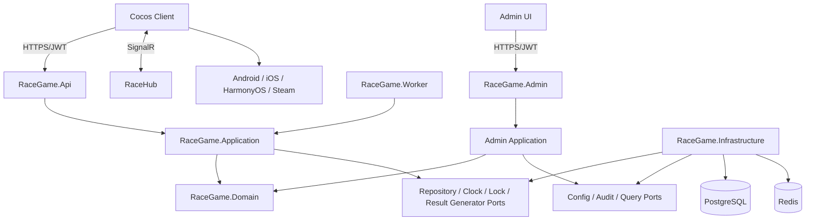

# RaceGame 需求执行方案

> 文档状态：Draft v0.3  
> 编制日期：2026-09-07  
> 关联需求：`Docs/02_Requirements/PRODUCT_REQUIREMENTS.md`  
> 工程规范：`Docs/PROJECT_STANDARDS.md`

## 1. 执行目标

以当前 V1.2 骨架为基础，优先交付“游戏前台服务 + 后台管理服务”的基础架构，先完成安全、可恢复的账号密码登录与比赛闭环，再增量实现马场、全服累计榜单、角色/物品、商城、每日任务和多端发布能力。

执行时遵循以下原则：

1. 先修复工程可构建与可测试基线，再扩展功能。
2. 服务端先冻结业务状态、API 和数据契约，客户端随后联调。
3. 钱包、下注、赛果和结算优先于视觉扩展功能。
4. 每个阶段都形成可演示、可回归、可回滚的增量，不进行一次性大重写。
5. 图片无法确认的规则不进入不可逆的数据设计。

## 2. 实施前提与估算口径

### 2.1 必要输入

- 高清原型或可缩放设计稿。
- 角色、马匹、赛道、图标、弹窗、字体和动画资源清单。
- 账号/密码规则（当前已确认无找回密码、无账号注销）。
- 赔率公式、黑马权重、奖励精度、商城、每日任务和角色成长规则表。
- 后台管理需要维护的实体清单、权限模型和审计要求。
- Android、iOS、HarmonyOS 构建要求，以及 Steam 发布与跨端账号策略。
- 目标在线人数、峰值下注 QPS 和部署环境。

### 2.2 粗略周期

在“1 名服务端 + 1 名 Cocos 客户端 + 1 名测试，产品/UI 可及时答疑”的前提下：

- P0 账号与核心比赛闭环：约 7–10 周。
- P1 马场、榜单、商城、每日任务、后台配置和内容能力：约 5–8 周。
- P2 运营后台、生产强化和多端发布：约 4–7 周。

该估算不包含美术资源制作、Steam 审核等待、鸿蒙适配验证、未来现金支付/广告接入和需求大改。完成剩余待确认项后应按故事点重新估算。

## 3. 目标架构



### 3.1 关键改造方向

- Application 定义游戏前台用例与持久化/锁/时钟抽象，Infrastructure 提供实现。
- 新增独立后台管理服务 `RaceGame.Admin`，负责配置、查询、审计和运营数据维护。
- Api 不再硬编码玩家 ID，从认证声明获取玩家身份。
- Worker 通过分布式租约推进轮次，并将每次状态转换实现为幂等操作。
- HTTP 提供权威快照，SignalR 提供低延迟通知；客户端重连后以快照纠偏。
- 赛果生成器具有稳定算法版本、稳定哈希/种子、马匹历史概率和黑马权重快照。
- 账号密码、会话、后台管理能力和审计能力遵循最小权限、限流、幂等与审计要求。

## 4. 阶段计划

## 阶段 0：需求冻结与资源盘点

**目标：** 把模糊原型转为可实现契约。

### 工作项

- 确认需求文档第 12.2 节剩余参数。
- 对长图中的每个页面编号，提供高清稿、状态稿和交互说明。
- 确定 P0/P1/P2 范围和明确不做项。
- 冻结赔率公式、黑马权重、手续费精度、破产补偿边界和榜单口径。
- 冻结后台管理需要维护的实体、字段、权限和审计范围。
- 确定 Android、iOS、HarmonyOS 与 Steam 的发布顺序和跨端账号策略。
- 建立资源清单：文件名、尺寸、锚点、帧率、压缩和授权来源。

### 交付物

- 审批后的 PRD v1.0。
- 页面流程图和 API/事件初稿。
- 数值规则表、账号安全规则、资源清单与多端发布清单。

### 退出条件

P0 不存在会改变钱包、订单、赛果、身份或数据库主结构的未决问题。

---

## 阶段 1：工程基线与测试骨架

**目标：** 确保后续每次修改都能真实构建和自动验证。

### 服务端

- 修复 `RaceGame.sln` 的 `ProjectConfigurationPlatforms`，避免空构建成功。
- 消除 `RaceGame.Application` 对 `AppDbContext` 的隐式依赖：定义仓储/工作单元抽象，由 Infrastructure 实现。
- 格式化触达的单行 C# 文件，保持功能不变。
- 增加 `.editorconfig`、统一包版本或构建属性文件。
- 建立 Domain/Application 单元测试、Infrastructure 集成测试和 Api 测试项目。
- 统一 API 响应 DTO、错误码和异常处理中间件。
- 引入 `ILogger<T>`，替换 Worker 的 `Console.WriteLine`。

### 客户端

- 补齐可提交的 Cocos Creator 3.8.x 工程元数据和 TypeScript 配置。
- 建立格式化、静态检查、API 环境配置和基础测试方式。
- 移除新代码中的 `any`，建立响应信封和错误模型。

### 验收

- API 项目和测试项目可 restore/build/test。
- 解决方案构建实际编译所有项目。
- Docker 中 PostgreSQL/Redis 可启动，测试可使用隔离数据库。
- CI 至少执行格式检查、服务端构建和测试。

---

## 阶段 2：账号密码、会话与配置安全

**目标：** 交付注册、登录、修改密码和安全会话，替换开发登录和硬编码玩家身份。

### 工作项

- 实现账号规范化与数据库唯一约束；注册请求包含账号、密码和确认密码。
- 使用 Argon2id、bcrypt 或 PBKDF2 等经过评审的算法加盐哈希密码，不保存明文或可逆密文。
- 注册事务性创建玩家、凭据、钱包和 1,000 初始化赠送流水；成功后返回登录页，不签发登录会话。
- 实现账号密码登录、短期访问令牌和服务端可撤销刷新会话。
- 设置页修改密码必须校验旧密码、新密码与确认新密码；成功后增加密码版本、撤销该玩家全部会话并强制返回登录页。
- 将 `POST /api/race/bet` 改为从认证声明获取 `playerId`。
- 对注册、登录和改密增加统一错误、限流、失败审计与可选临时锁定，避免账号枚举和暴力破解。
- 将数据库、Redis、JWT 和后台管理相关密钥移至环境变量/密钥服务。
- 按环境限制 `dev-login`、Swagger、CORS 和错误详情。

### 建议迁移

- `002_add_credentials_sessions_admin_and_wallet_concurrency.sql`
- 凭据表保存账号规范化值、密码哈希、密码版本、失败/锁定字段；会话表保存哈希后的刷新令牌与撤销状态。
- 同阶段落地管理员账号、角色、会话与审计日志基础表，为后台管理服务做准备。
- 为钱包配置真正的并发令牌或采用原子余额扣减策略。

### 测试

- 注册成功、重复账号、并发注册、两次密码不一致和不合规密码。
- 正确/错误密码、统一错误提示、账号枚举防护、限流、令牌过期/撤销和并发刷新。
- 修改密码旧密码错误、新密码确认不一致、成功后全部旧会话失效。
- 管理员登录、权限校验与审计记录。
- 初始 1,000 只发放一次；未认证/伪造身份下注必须失败。

### 验收

正式环境无法访问 `dev-login`，下注不再硬编码玩家 ID；改密后旧密码和所有旧会话立即失效。

---

## 阶段 3：核心轮次、下注、赛果与结算加固

**目标：** 达到资金类虚拟资产操作所需的一致性基线。

### 3.1 状态机

- 将轮次转换集中到 Application 用例，不允许 Worker 随意改状态。
- 每个转换使用期望状态条件更新，避免并发推进。
- 将阶段时长配置化，并记录用于该轮的实际时间参数。
- 定义取消、故障恢复和人工补偿策略。

### 3.2 分布式任务

- 实现 Redis 锁的所有权校验释放脚本、租约续期和超时。
- 锁键按任务/轮次命名，例如 `race:round:{id}:advance`。
- 多实例竞争时只有持有者执行，数据库条件更新作为第二道防线。
- Worker 正常响应取消并使用结构化日志。

### 3.3 马匹主数据与当轮赔率

- 新建长期马匹主数据，保存多语言资料、素材、上下架状态、出场次数和第 1–6 名统计。
- 马匹及其资料由后台管理服务维护和发布，游戏前台仅读取启用数据。
- 每轮从启用马匹中随机抽取 6 匹不同马；不足 6 匹时停止创建并告警。
- 定义版本化赔率计算器，根据当前上场 6 匹马的全部历史记录和各名次概率生成当轮相对赔率。
- 处理新马/低样本冷启动、赔率上下限和异常统计；将输入统计、公式版本和输出赔率保存为轮次快照。

### 3.4 下注与钱包

- 单笔最小金额设为 2，不设置业务最大值、固定步进或单轮累计上限，但不得超过余额与数据库安全范围。
- 允许玩家在同轮对已选马追加多笔下注；选择另一匹马仍拒绝。
- 使用数据库唯一约束和事务处理每笔订单的幂等键竞争。
- 使用行锁、并发令牌或条件原子 SQL 防止负余额。
- 将成功响应补充订单号、锁定赔率、预计毛奖励/手续费/净奖励、余额、服务器时间和轮次摘要。
- 定义稳定业务错误码，不返回内部异常文本。

### 3.5 赛果

- 替换 `string.GetHashCode()`，使用稳定哈希/密码学随机源和版本化算法。
- 使用 6 匹马上场历史第 1–6 名概率和黑马权重进行加权随机，生成无重复完整排名。
- 对当前上场 6 匹马按胜率排序，取第 4–6 名为黑马候选；按第 1/3/5 与第 2/4/6 胜率和差值触发黑马流程，命中后进行 1000 次随机抽样决定黑马。
- 保存输入种子承诺或审计材料、历史统计快照、黑马权重版本、算法版本、完整排名和动画参数。
- 同轮重复生成返回同一结果。
- 将“公平性可公开验证”作为独立评审项；未完成前不得作相关宣传。

### 3.6 结算与累计统计

- 以订单或轮次为幂等边界。
- 按毛奖励区间 0.05%/0.1%/0.5%/1% 计算手续费和净奖励，边界按 PRD 的连续区间执行。
- 所有金额以分为最小单位并四舍五入到 2 位小数。
- 为订单新增毛奖励、手续费率、手续费金额、净奖励和舍入版本快照，逐步弃用语义含糊的单一 `PotentialReward`。
- 奖励与手续费流水唯一键由订单稳定生成。
- 结算事务性更新玩家参与/获胜轮次和马匹出场/第 1–6 名统计；同轮多订单只增加一次玩家参与统计。
- 结算失败可重试；部分失败不能把轮次错误标记为完成。
- 对账任务校验订单、手续费、钱包流水、轮次和累计统计。

### 3.7 破产补偿

- 钱包余额由正数变为 0 时幂等创建 2 小时补偿任务。
- 到期自动发放 1,000，并按 `Europe/London` 自然日限制每人最多成功发放 5 次。
- 补偿状态持久化，Worker 重启或多实例竞争不得漏发/重复发放。
- 初始化、触发、到期发放、每日上限和等待期内余额变化均加入自动化测试。

### 测试重点

- 并发同幂等键、不同幂等键、余额临界值、截止瞬间。
- 两个 Worker、多次重启、锁过期、数据库暂时失败。
- 重复生成赛果、重复结算、手续费边界、累计统计、部分结算失败和恢复。
- 破产补偿并发触发、2 小时到期、伦敦日界线/夏令时、每日第 5/6 次和 Worker 重启。

### 验收

P0 端到端场景 3–9 全部自动化通过。

---

## 阶段 4：实时通信与客户端状态模型

**目标：** 客户端在正常、断网和重连情况下都展示服务端真实状态。

### 服务端

- 定义并版本化 SignalR 事件 DTO。
- 按轮次组广播状态变化、赛果可用和结算完成。
- 广播只做通知；完整状态始终可由 HTTP 快照恢复。
- 增加连接鉴权、组权限和连接指标。

### 客户端

- 建立单一 `RaceStore`/状态控制器，统一持有当前轮次、玩家下注和连接状态。
- 启动、回前台和重连后调用 `GET /api/race/current`。
- 使用服务器时间偏差计算倒计时，不以本地时钟直接决定截止。
- 为请求增加超时、取消、重试和幂等结果恢复。
- 组件销毁时注销 SignalR、事件和定时器。

### 验收

- 正常状态变化延迟达到需求目标。
- 人为断网 10–30 秒后恢复，客户端不重复下注且能进入正确阶段。
- 丢失任意一个 SignalR 事件后，HTTP 校准能恢复一致。

---

## 阶段 5：P0 竖屏页面和核心体验

**目标：** 按高清原型完成可玩的视觉闭环。

### 5.1 场景拆分建议

```text
Canvas
└─ RaceRoot
   ├─ SafeArea
   │  ├─ TopBar
   │  ├─ LobbyLayer
   │  ├─ Track
   │  │  ├─ Lane01/Horse01
   │  │  ├─ ...
   │  │  └─ Lane06/Horse06
   │  ├─ BettingPanel
   │  ├─ ResultPanel
   │  └─ BottomNavigation
   ├─ ModalLayer
   ├─ ToastLayer
   └─ LoadingLayer
```

如改变现有节点路径，必须同步更新 `Docs/08_Client/SCENE_NODE_STRUCTURE.md`。

### 5.2 工作项

- 注册、账号密码登录、修改密码后强制退出和失败重试。
- 大厅顶部玩家摘要、中央角色/主视觉，以及“任务、马场、赛事、排行、商城”底部导航。
- 设置页中英文切换、修改密码和伦敦时间展示。
- 6 匹马卡片、历史数据摘要、当轮赔率、自由金额输入和二次确认。
- 准备倒计时、比赛动画、音效和性能降级。
- 正式结算结果面板、输赢反馈和下一轮入口。
- Loading、空状态、弱网、维护、业务失败和通用确认弹窗。
- Android、iOS、HarmonyOS 的安全区、不同屏幕比例和低端机适配；组件设计预留 Steam 鼠标键盘和桌面比例。

### 5.3 验收

- 与确认后的原型逐页视觉验收。
- 关键按钮防连点、状态切换无残留、返回前台可恢复。
- 赛道最终排名严格匹配服务端结果。
- 在目标最低机型达到确认后的 FPS 和内存标准。

---

## 阶段 6：P1 马场、榜单、内容与虚拟经济

**目标：** 实现马场、全服累计榜单、记录、角色/物品、商城、每日任务和后台管理基础能力，不引入真实货币前台购买或客户端权威发奖。

### 6.1 记录

- 增加玩家订单分页查询和轮次详情 DTO。
- 客户端实现列表、筛选、分页加载、空状态和详情。
- 后台管理支持按玩家、轮次、时间范围查询用户比赛记录。

### 6.2 马场

- 将“成就壮举”页面和导航语义替换为“马场”。
- 实现马匹分页列表和详情，展示出场次数、第一名次数、胜率和第 1–6 名统计。
- 通过后台管理服务维护马匹主数据、图片、多语言信息、上下架状态和统计查看。

### 6.3 全服累计榜单

- 实现开服累计个人胜率榜和马匹胜率榜，不按周期重置。
- 个人榜按获胜轮次/参与轮次，马匹榜按第一名次数/出场次数；结算后更新缓存。
- 实现最低样本、同分排序、当前玩家定位和分页；不在客户端累计分值。

### 6.4 角色/物品

- 角色、装扮和物品只做视觉展示与装备，不进入赔率、赛果和榜单计算。
- 新账号发放默认角色；建立模板与玩家拥有关系，切换时验证所有权。
- 后台管理服务维护角色模板、等级经验表、升级奖励、默认发放策略和启用状态。
- 实现比赛经验和成长奖励前先冻结配置表；所有获取、消耗和重复物品均需审计。

### 6.5 商城与每日任务

- 商城由后台管理配置，支持金币商品和现金商品两类数据结构；当前前台只开放金币购买。
- 商城金币购买需事务性完成订单、扣款流水与物品发放，不接入真实货币支付。
- 任务只实现每日任务，由后台配置任务条件、奖励和启用状态。
- 首批每日任务固定支持：比赛场数（3/10/20）、比赛胜场（1/3/5）、比赛负场（1/3/5）。
- 商品购买和任务领奖必须具备限流、幂等键和审计。

### 6.6 公告、设置与后台管理基础能力

- 增加公告表、有效期、版本和发布状态；客户端按版本展示并记录已读状态。
- 增加玩家语言偏好，支持简体中文和英文资源切换。
- 交付后台管理服务基础能力：管理员登录、权限控制、审计日志，以及对角色、等级经验、奖励、任务、商城、马匹、用户账号、用户角色和用户比赛记录的查询与配置。

### 建议迁移

- `003_add_horse_catalog_odds_and_settlement_snapshots.sql`
- `004_add_player_stats_and_relief_grants.sql`
- `005_add_characters_levels_and_inventory.sql`
- `006_add_shop_and_daily_tasks.sql`
- `007_add_notices_player_settings_and_admin_queries.sql`

每个迁移应独立可部署，不应提前创建仍未确认的算法参数字段。

---

## 阶段 7：P2 运营、审计与生产部署

**目标：** 具备受控运营和正式环境基础。

### 工作项

- 建立独立后台管理 API/服务：马匹/素材、角色、等级经验、奖励、任务、任务条件、商城、轮次、订单、钱包流水、错误、公告和用户查询。
- 后台管理员体系支持账号、角色、权限、会话、操作审计和最小权限控制。
- 马匹管理支持上传素材、新增/编辑资料、上下架和查看统计；历史比赛快照不随主数据编辑改变。
- 角色/任务/商城/公告管理支持发布、下架、版本化和生效时间控制。
- 用户查询支持账号信息、角色信息、比赛记录和补偿记录查看；敏感写操作按权限和审计控制。
- 运营写操作实施最小权限、强认证、审计、幂等和必要的双人复核。
- 生产数据库迁移改为受控任务，移除启动时无条件自动迁移。
- PostgreSQL/Redis 不直接暴露公网端口，使用最小权限账号和备份策略。
- 健康检查区分存活、就绪、数据库、Redis、Worker 和后台管理服务状态。
- 接入指标、日志聚合、追踪和告警。
- 完成容量压测、故障演练、数据恢复和回滚演练。

### 验收

- 生产配置无仓库硬编码秘密。
- 能在预发布环境完成升级、回滚、重启、断网和双实例演练。
- 关键告警可触发并定位到轮次/订单。

---

## 阶段 8：Android、iOS、HarmonyOS 与 Steam 发布

**目标：** 完成移动端发布，并根据排期适配和发布 Steam 桌面版本。

### 工作项

- Android：确定最低系统版本、签名、包名、权限、商店资料和隐私清单。
- iOS：确定最低系统版本、证书、描述文件、隐私清单和 App Store 审核资料。
- HarmonyOS：验证 Cocos 3.8.x 实际导出/运行兼容性，必要时评估原生适配工作量。
- Steam：创建 Steamworks 应用，确定英文商店名称、商店页、构建分支、成就/云存档是否接入及审核资料。
- Steam 客户端适配窗口/全屏、多分辨率、鼠标键盘、退出流程和桌面性能。
- 确定移动端与 Steam 是否共用账号和服务器；若共用，自有账号密码体系必须支持跨端登录和会话管理。
- 为各环境使用独立配置，不在安装包中写入服务端秘密。
- 完成用户协议、隐私政策、账号删除流程、商店审核、灰度发布和回归测试。

### 限制

本期不接入第三方账号登录或真实货币支付。Steam 发布不等同于接入 Steam 登录；只有产品另行确认后才实现 Steamworks 身份绑定。

## 5. 代码落点规划

| 能力 | Domain | Application | Infrastructure | Api/Worker | Client |
| --- | --- | --- | --- | --- | --- |
| 账号认证 | 凭据/会话规则 | 注册、登录、改密用例 | 密码哈希、凭据/会话仓储 | Auth Controller/认证配置 | 注册、登录、设置、会话管理 |
| 后台管理 | 管理员/权限/审计规则 | 配置、发布、查询用例 | 管理员仓储/审计仓储 | Admin API/后台认证 | Admin UI |
| 马场 | 马匹与历史统计 | 马匹查询/导入用例 | 马匹仓储/素材引用 | Stable/Admin API | 马场列表和详情 |
| 下注 | 订单/钱包不变量 | PlaceBet 用例 | EF 事务与并发实现 | Betting Controller | 下注面板与幂等键 |
| 轮次赔率 | 状态/赔率快照 | Create/AdvanceRound 用例 | 轮次仓储/锁 | Worker/Hub | RaceStore/倒计时 |
| 赛果 | 概率/黑马权重结果 | GenerateResult 用例 | 种子/快照/审计存储 | Worker/查询 API | 动画播放 |
| 结算 | 手续费/奖励规则 | SettleRound 用例 | 钱包事务/对账 | Worker/结果事件 | 结果页 |
| 破产补偿 | 补偿策略 | Schedule/GrantRelief 用例 | 任务/流水仓储 | Worker/Player API | 倒计时和状态提示 |
| 榜单 | 累计胜率定义 | 统计/查询用例 | PostgreSQL/Redis | Leaderboard API | 双榜单页 |
| 角色物品 | 纯展示/拥有规则 | 查询/装备用例 | 仓储 | Character API/Admin API | 列表/详情/装备 |
| 商城任务 | 订单/进度/奖励规则 | 购买/推进/领奖用例 | 仓储 | Shop/Task/Admin API | 对应页面 |
| 公告设置 | 公告/语言规则 | 查询/发布/偏好用例 | 仓储/缓存 | Notice/Settings/Admin API | 公告与中英文切换 |

## 6. API 与契约执行顺序

1. 先定义共享的请求/响应示例、错误码和 SignalR 事件文档。
2. 服务端实现 DTO、校验和契约测试。
3. 客户端生成或手写严格类型，不直接使用 `any`。
4. 联调环境执行成功、失败、超时、重复和版本兼容场景。
5. API 破坏性变更通过新版本或兼容窗口处理，不能直接替换线上字段。

建议先冻结以下 P0 契约：

- `RegisterRequest/Response`
- `LoginRequest/Response`
- `ChangePasswordRequest`
- `PlayerSummaryDto`（含余额和破产补偿状态）
- `CurrentRaceDto`
- `RaceHorseDto`（含马匹 ID、历史摘要和当轮赔率）
- `PlaceBetRequest/Response`（含毛奖励、手续费和净奖励）
- `RaceResultDto`
- `PlayerSettlementDto`
- `DailyTaskDto/ClaimRewardRequest`
- `ShopProductDto/ShopOrderRequest`
- `AdminHorseUpsertRequest`
- `AdminCharacterConfigDto`
- `AdminPlayerQueryDto`
- `ApiError`
- 3 个核心 SignalR 事件 DTO

## 7. 数据迁移策略

1. 保留 `Database/DeployInit/001_initial.sql` 不变。
2. 每个阶段使用独立递增迁移，EF 模型与 SQL 同步评审。
3. 迁移先在一次性副本数据上验证耗时、锁影响和回滚。
4. 生产环境由部署任务执行迁移，不由每个 API 实例并发调用 `Database.Migrate()`。
5. 破坏性变更采用“新增字段 → 双写/回填 → 切读 → 删除旧字段”的扩展/收缩模式。
6. 钱包和订单约束变更前先检查并清理历史重复或异常数据。

## 8. 测试方案

### 8.1 单元测试

- 状态转换矩阵和时间边界。
- 注册/登录/改密规则、密码版本和会话撤销。
- 最小下注 2、同马追加、锁定赔率、手续费区间、奖励精度和舍入。
- 马匹历史概率、赔率公式、黑马权重和稳定赛果算法的固定测试向量。
- 破产补偿、累计胜率、角色/物品、商城和任务规则。

### 8.2 集成测试

- PostgreSQL 真实事务、账号唯一性、会话撤销、并发扣款、手续费和结算统计。
- Redis 锁获取、续租、所有权释放、破产补偿任务和过期竞争。
- 后台管理配置发布、审计日志和权限过滤。

### 8.3 API 测试

- 认证授权、输入校验、错误映射和响应信封。
- 幂等重放和并发请求。
- 分页、字段可见性和隐私脱敏。

### 8.4 Worker 测试

- 虚拟时钟驱动完整轮次。
- 双 Worker 竞争、进程重启和阶段恢复。
- 赛果已生成但未结算、部分结算失败等恢复场景。

### 8.5 客户端测试

- DTO 解析、服务端校时和倒计时边界。
- 页面状态机、按钮防连点、断网和重连。
- 6 匹马动画结果一致性。
- 中英文资源、伦敦时间/夏令时、多分辨率、安全区和移动端最低机型性能。
- Steam 窗口/全屏、桌面比例和鼠标键盘操作。

### 8.6 发布验证

- P0 需求文档第 11 节全部通过。
- 压测、故障演练、备份恢复和回滚通过。
- 账号注册/登录/改密、后台管理关键流程和目标商店审核环境回归通过。

## 9. 环境与 CI/CD

建议环境：

- Local：本地 Docker PostgreSQL/Redis，允许开发登录。
- Test：自动化测试隔离环境，使用虚拟时钟和后台管理测试账号。
- Staging：与生产拓扑一致，包含游戏前台服务、后台管理服务和多端候选包。
- Production：自有账号体系、后台管理服务、受控迁移、限制 Swagger/CORS 和最小权限网络。

CI 最低门禁：

```text
format/lint
→ restore
→ build concrete projects
→ unit tests
→ PostgreSQL/Redis integration tests
→ API contract tests
→ artifact build
→ staging deploy
→ smoke tests
```

当前 `RaceGame.sln` 会空构建成功，修复项目配置映射前必须直接构建 `Server/RaceGame.Api/RaceGame.Api.csproj` 等实际项目。

## 10. 风险与应对

| 风险 | 影响 | 应对 |
| --- | --- | --- |
| 原型文字不可读、规则未冻结 | 返工数据与 UI | 阶段 0 获取高清稿并冻结 P0 |
| Application/Infrastructure 依赖不一致 | 无法可靠构建 | 阶段 1 优先抽象端口并补测试 |
| 钱包并发和幂等不足 | 重复扣款/负余额 | 数据库约束、原子更新、事务和并发测试 |
| Worker 多实例重复执行 | 重复赛果/结算 | Redis 租约 + 数据库条件更新双保险 |
| 赛果算法不可复核 | 争议与跨实例不一致 | 稳定算法、版本、测试向量和审计记录 |
| SignalR 事件丢失 | 客户端状态错误 | HTTP 快照兜底、重连校准 |
| 赔率/黑马公式未固化 | 赛果、赔率与测试无法定稿 | 冻结版本化公式、冷启动和固定测试向量 |
| 密码体系实现不当 | 账号泄漏和撞库风险 | 自适应哈希、限流、会话撤销和安全评审 |
| 后台管理权限或审计不足 | 配置误操作和敏感信息泄漏 | 角色权限、二次确认、发布流和审计日志 |
| 破产补偿并发或日界线错误 | 重复发币或玩家投诉 | 持久化任务、幂等流水、伦敦时区边界测试 |
| 鸿蒙/Steam 适配能力不确定 | 发布延期 | 尽早制作技术验证包并确定发布顺序 |
| 缺少美术/动画规范 | 客户端排期失控 | 资源清单、命名规范和逐页验收 |
| 无峰值指标 | 无法容量设计 | 提供 DAU/CCU/QPS，阶段 7 压测校准 |

## 11. 里程碑与发布门禁

| 里程碑 | 内容 | 发布门禁 |
| --- | --- | --- |
| M0 需求冻结 | 算法、账号、后台字段、原型、资源和发布顺序确认 | 无结构性待确认项 |
| M1 工程可持续 | 构建、测试、CI、错误模型 | 真实项目构建与测试通过 |
| M2 安全核心闭环 | 注册/登录/改密、后台认证、马匹、下注、赔率、赛果、结算、补偿 | 安全/并发/幂等/双 Worker 测试通过 |
| M3 可玩版本 | 大厅、下注、比赛、结果、重连、中英文 | 核心 E2E 和视觉验收通过 |
| M4 内容版本 | 马场、双榜单、记录、角色、商城、每日任务、公告、后台配置 | 对应规则、权限和审计测试通过 |
| M5 候选发布 | 运维、安全、压测和多端商店发布 | 故障演练与目标商店审核通过 |

## 12. 每阶段完成定义

- 需求与验收条件已更新并经相关角色确认。
- 架构边界和核心业务不变量未被破坏。
- 数据迁移可部署、可验证、可回滚。
- 新代码已格式化，具体项目可构建，相关测试通过。
- 成功、失败、边界、并发、重试和取消路径按风险覆盖。
- API、数据库、配置、部署或 Cocos 节点变化已同步文档。
- 未引入硬编码身份、秘密、不安全生产默认值或客户端权威资产逻辑。
- 已记录实际验证命令、结果、已知限制和可观测指标。

## 13. 建议立即启动的任务

在未取得高清原型前，可以安全并行启动且不会锁死业务规则的事项：

1. 修复解决方案项目映射和 Application 依赖方向。
2. 建立测试项目、`.editorconfig`、统一错误模型和 CI。
3. 抽象时钟、仓储、分布式锁、密码哈希/会话、赔率计算器、黑马权重赛果生成器和后台管理配置端口。
4. 为现有核心流程补基线测试，先复现再修复并发/幂等问题。
5. 设计马匹主数据、概率/赔率快照、累计统计、破产补偿和后台管理数据模型，但在公式冻结前不固化算法参数。
6. 启动后台管理服务骨架：管理员认证、审计日志、基础查询与配置发布。
7. 建立客户端环境配置、严格 DTO、HTTP 错误处理、RaceStore 和中英文资源框架。
8. 制作 Android/iOS/HarmonyOS/Steam 最小技术验证包，尽早识别导出与输入适配风险。
9. 建立原型页面/资源编号表，等待高清稿后补齐视觉细节。

不应在规则未确认时提前实施：赔率/黑马精确参数、现金支付接入、角色经验表最终值、Steamworks 身份或真实货币能力。
